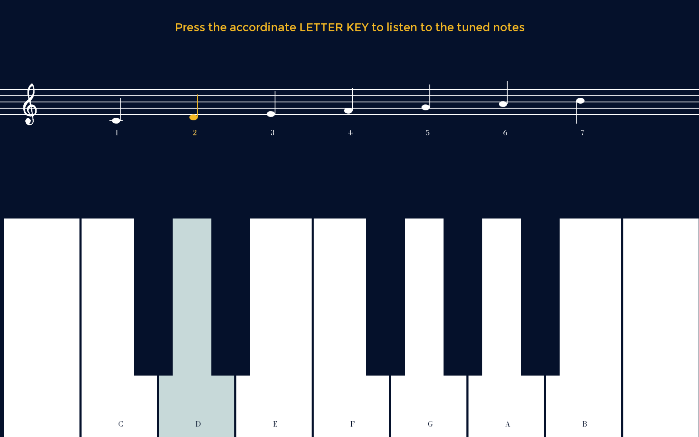

# Project 3_GAME Update
### How to Play

1. Read the Instruction on the floating circle

2. On the second page, listen to the tuned notes and get familiar with the keyboard and notes

3. Click anywhere on the screen to listen the notes and press the number keys

4. Hit "return" key to restart

## Further TO-FIX List

1. Add the Instruction writing 
