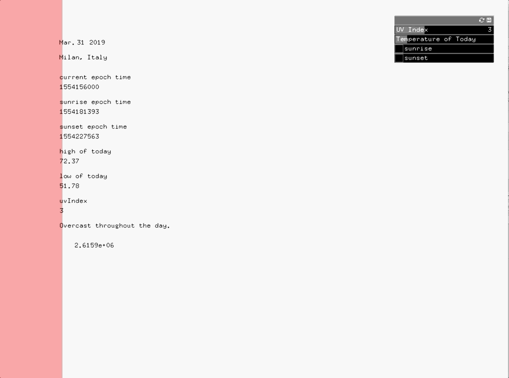

# JSON Weather

1. The "UV Index" controls the opacity of the background. (The dangerous range for UV Index is from 8 -10 and the color gets closer to RED!!)
2. The temperature decides the size of the background, from the lowest temperature of the day to the highest.
3. The position of sunrise and sunset is scaled, comparing the sunrise/sunset time to a 24-hour day scheme.

* It is one day late. I think it is because the average day of month (from January to now) is smaller than the average day of month over a year (30.44).

